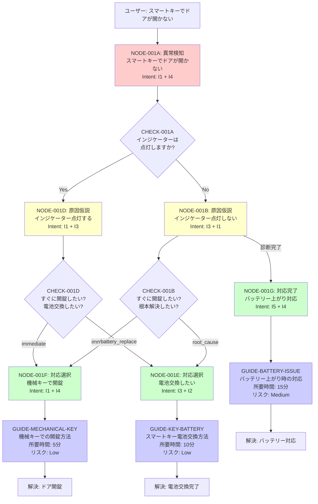

# ジャーニーマップ: THEME-001 スマートキーでドアが開かない

## 概要

**テーマ**: ドアが開かない  
**緊急度**: High  
**主要意図**: I1（今すぐ使いたい）, I3（自分で直したい）, I4（壊したくない・安全優先）

---

## ジャーニーフロー図



---

## ノード詳細

### NODE-001A: 異常検知（初期ノード）

**状態**: スマートキーでドアが開かない  
**トリガー**: ドアに触れた  
**仮説**:
- スマートキー電池切れ
- 車両バッテリー上がり
- 電波干渉

**意図推測**:
- Primary: I1（今すぐ使いたい） - 優先度: 90%
- Secondary: I4（壊したくない・安全優先） - 優先度: 80%

**L2文脈データ収集**:
- 車両バッテリー電圧
- スマートキーのインジケーター状態
- 時刻（深夜/日中）
- 場所（自宅/外出先）
- ユーザースキルレベル

**次のアクション**: CHECK-001A（インジケーター確認）

---

### NODE-001B: 原因仮説（インジケーター点灯しない）

**状態**: インジケーターが点灯しない  
**トリガー**: 解錠操作  
**仮説**:
- スマートキー電池切れ（最有力）
- 電波干渉

**意図推測**:
- Primary: I3（自分で直したい） - 優先度: 80%
- Secondary: I1（今すぐ使いたい） - 優先度: 70%

**L2文脈データによる調整**:
```python
if context.time == "night":
    I1.priority += 30  # 深夜は即時対応の優先度UP
if context.user_skill == "beginner":
    I1.priority += 20  # 初心者は簡単な方法を優先
if context.past_experience.battery_replace:
    I3.priority += 20  # 過去に電池交換経験あり
```

**次のアクション**: CHECK-001B（意図確認）

---

### NODE-001D: 原因仮説（インジケーター点灯する）

**状態**: インジケーターが点灯する  
**トリガー**: 解錠操作  
**仮説**:
- 車両バッテリー上がり（可能性低）
- 電波干渉

**意図推測**:
- Primary: I1（今すぐ使いたい） - 優先度: 80%
- Secondary: I3（自分で直したい） - 優先度: 70%

**L2文脈データによる調整**:
```python
if context.location == "remote":
    I3.priority += 20  # 遠隔地では自力対応を優先
if context.time == "night":
    I1.priority += 30  # 深夜は即時対応を優先
```

**次のアクション**: CHECK-001D（意図確認）

---

### NODE-001E: 対応選択（電池交換したい）

**状態**: 電池交換したい  
**トリガー**: 根本解決意図  
**提案**: 電池交換手順 or 販売店依頼

**意図推測**:
- Primary: I3（自分で直したい） - 優先度: 70%
- Secondary: I2（原因を知りたい） - 優先度: 60%

**次のアクション**: GUIDE-KEY-BATTERY（電池交換手順）

---

### NODE-001F: 対応選択（機械キーで開錠したい）

**状態**: 機械キーで開錠したい  
**トリガー**: 即時解決意図  
**提案**: 機械キー使用手順

**意図推測**:
- Primary: I1（今すぐ使いたい） - 優先度: 90%
- Secondary: I4（壊したくない・安全優先） - 優先度: 80%

**次のアクション**: GUIDE-MECHANICAL-KEY（機械キー開錠手順）

---

### NODE-001G: 対応完了（バッテリー上がり対応が必要）

**状態**: バッテリー上がり対応が必要  
**トリガー**: 診断完了  
**提案**: ジャンプスタート or ロードサービス

**意図推測**:
- Primary: I5（誰かに頼みたい） - 優先度: 85%
- Secondary: I4（壊したくない・安全優先） - 優先度: 80%

**次のアクション**: GUIDE-BATTERY-ISSUE（バッテリー対応手順）

---

## ガイドコンテンツ

### GUIDE-MECHANICAL-KEY: 機械キーでの開錠方法

**タイプ**: procedure  
**所要時間**: 5分  
**リスクレベル**: Low

**手順**:
1. スマートキーから機械キーを取り出す
2. 運転席ドアのキー穴カバーを外す
3. 機械キーを差し込んで回す
4. ドアを開ける

**注意事項**:
- セキュリティアラームが鳴る場合があります
- エンジンをかけるとアラームは停止します

---

### GUIDE-KEY-BATTERY: スマートキー電池交換方法

**タイプ**: procedure  
**所要時間**: 10分  
**リスクレベル**: Low

**手順**:
1. 機械キーを取り出す
2. スマートキーのカバーを開ける
3. 古い電池を取り出す（CR2032）
4. 新しい電池を入れる（+極を上に）
5. カバーを閉じる
6. 動作確認をする

**必要なもの**:
- CR2032電池（コンビニ・家電量販店で購入可能）

---

### GUIDE-BATTERY-ISSUE: バッテリー上がり時の対応

**タイプ**: procedure  
**所要時間**: 15分  
**リスクレベル**: Medium

**手順**:
1. 他の車両からジャンプスタートを依頼
2. ブースターケーブルを接続
3. エンジンを始動
4. 30分以上走行して充電

**または**:
- ロードサービスに連絡: [連絡先]

**注意事項**:
- バッテリー上がりを繰り返す場合は販売店で点検を受けてください

---

## L2文脈データの活用例

### ケース1: 深夜・外出先・初心者

**文脈データ**:
- 時刻: 23:00（深夜）
- 場所: 外出先
- ユーザースキルレベル: 初心者
- 過去の経験: なし

**意図推測の調整**:
```
NODE-001A:
  I1（今すぐ使いたい）: 90 + 30（深夜） = 120
  I4（壊したくない）: 80 + 20（初心者） = 100

→ 優先提案: 機械キーでの開錠（GUIDE-MECHANICAL-KEY）
```

---

### ケース2: 日中・自宅・経験者

**文脈データ**:
- 時刻: 14:00（日中）
- 場所: 自宅
- ユーザースキルレベル: 中級者
- 過去の経験: 電池交換経験あり

**意図推測の調整**:
```
NODE-001B:
  I3（自分で直したい）: 80 + 20（経験あり） = 100
  I1（今すぐ使いたい）: 70

→ 優先提案: 電池交換手順（GUIDE-KEY-BATTERY）
```

---

## UXログ記録項目（L4連携）

各ノードで以下のデータを記録:

```json
{
  "session_id": "SESSION-12345",
  "theme_id": "THEME-001",
  "journey_path": [
    {
      "node_id": "NODE-001A",
      "timestamp": "2026-01-27T23:15:00Z",
      "context": {
        "time": "night",
        "location": "remote",
        "user_skill": "beginner"
      },
      "estimated_intent": {
        "primary": "I1",
        "secondary": "I4"
      }
    },
    {
      "node_id": "NODE-001B",
      "timestamp": "2026-01-27T23:16:00Z",
      "check_id": "CHECK-001B",
      "user_answer": "immediate"
    },
    {
      "node_id": "NODE-001F",
      "timestamp": "2026-01-27T23:17:00Z",
      "guide_id": "GUIDE-MECHANICAL-KEY",
      "completion_time": "5min",
      "satisfaction": 5
    }
  ],
  "outcome": "resolved",
  "total_time": "7min"
}
```

---

## 継続的改善のポイント

1. **離脱率の高いノード**を特定 → 質問や選択肢を改善
2. **意図推測の精度**を測定 → L2文脈データの調整ロジックを最適化
3. **ガイドの満足度**を収集 → コンテンツの改善
4. **よく選ばれるパス**を分析 → デフォルト提案の最適化

---

## 関連ファイル

- `Theme.csv`: テーマ定義
- `JourneyNode.csv`: ノード定義
- `CheckCondition.csv`: 判定条件
- `Edge.csv`: 分岐定義
- `Guide.csv`: ガイドコンテンツ
- `NodeIntent.csv`: 意図マッピング
- `IntentAction.csv`: 意図別アクション
