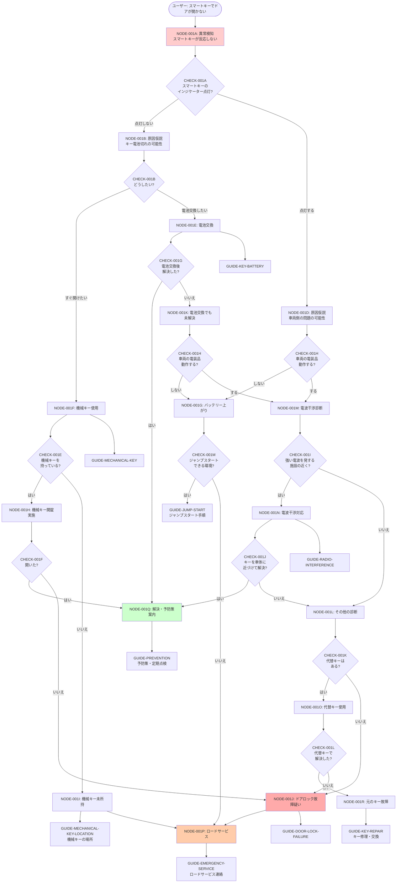

# THEME-001「スマートキーでドアが開かない」完全網羅版フロー

## 全体構造

---

## ノード定義

### 初期診断フェーズ

#### NODE-001A: 異常検知
- **State**: スマートキーでドアが開かない
- **Trigger**: ドアに触れた、ボタンを押した
- **Hypotheses**: キー電池切れ、車両バッテリー上がり、電波干渉、システム故障
- **Intent**: I1（今すぐ使いたい）+ I4（壊したくない）

#### NODE-001B: 原因仮説（キー電池切れ疑い）
- **State**: インジケーターが点灯しない
- **Hypotheses**: スマートキー電池切れ、電波干渉
- **Intent**: I3（自分で直したい）+ I1（今すぐ使いたい）

#### NODE-001D: 原因仮説（車両側問題疑い）
- **State**: インジケーターは点灯する
- **Hypotheses**: 車両バッテリー上がり、車両システム故障
- **Intent**: I1（今すぐ使いたい）+ I5（誰かに頼みたい）

---

### 機械キー開錠ルート

#### NODE-001F: 機械キー使用決定
- **State**: 機械キーでの開錠を選択
- **Intent**: I1（今すぐ使いたい）

#### NODE-001H: 機械キー開錠実施
- **State**: 機械キーで開錠を試みている
- **Intent**: I1 + I4

#### NODE-001I: 機械キー未所持
- **State**: 機械キーが見つからない
- **Intent**: I5（誰かに頼みたい）
- **Next**: ロードサービス or 機械キーの場所案内

---

### 電池交換ルート

#### NODE-001E: 電池交換決定
- **State**: 電池交換を実施
- **Intent**: I3（自分で直したい）

#### NODE-001K: 電池交換でも未解決
- **State**: 電池交換したが問題が解決しない
- **Hypotheses**: 複数原因、車両側の問題
- **Intent**: I2（原因を知りたい）+ I5

---

### バッテリー上がりルート

#### NODE-001G: バッテリー上がり判定
- **State**: 車両バッテリー上がりと判定
- **Intent**: I5（誰かに頼みたい）+ I3（自分で直したい）

---

### 電波干渉ルート

#### NODE-001M: 電波干渉診断
- **State**: 電波干渉の可能性を確認
- **Intent**: I2（原因を知りたい）

#### NODE-001N: 電波干渉対応
- **State**: 電波干渉への対応を実施
- **Intent**: I3（自分で直したい）

---

### その他診断ルート

#### NODE-001L: その他の診断
- **State**: 他の原因を探る
- **Intent**: I2 + I5

#### NODE-001O: 代替キー使用
- **State**: 代替のスマートキーで試す
- **Intent**: I3

---

### 問題判定ルート

#### NODE-001J: ドアロック故障疑い
- **State**: ドアロックシステムの故障の可能性
- **Intent**: I5（誰かに頼みたい）

#### NODE-001R: 元のキー故障
- **State**: スマートキー本体の故障と判定
- **Intent**: I5

---

### 終端ノード

#### NODE-001P: ロードサービス
- **State**: ロードサービスへの連絡が必要
- **Intent**: I5

#### NODE-001Q: 解決・予防策案内
- **State**: 問題解決、予防策の案内
- **Intent**: I6（後で対応したい）

---

## 判定条件定義

| Check ID | Question | Answer Type | Answers | Notes |
|:---------|:---------|:------------|:--------|:------|
| CHECK-001A | スマートキーのインジケーターは点灯しますか? | boolean | yes/no | 電池残量の初期判定 |
| CHECK-001B | どうしたいですか? | choice | immediate/battery_replace | ユーザー意図確認 |
| CHECK-001E | 機械キーを持っていますか? | boolean | yes/no | 機械キー所持確認 |
| CHECK-001F | 機械キーで開きましたか? | boolean | yes/no | 開錠成功確認 |
| CHECK-001G | 電池交換後、解決しましたか? | boolean | yes/no | 電池交換効果確認 |
| CHECK-001H | 室内灯やメーターは点灯しますか? | boolean | yes/no | 車両バッテリー確認 |
| CHECK-001I | 近くに強い電波を発する施設（空港、放送局等）がありますか? | boolean | yes/no | 電波干渉可能性 |
| CHECK-001J | キーを車体に近づけて操作すると解決しますか? | boolean | yes/no | 電波干渉対応確認 |
| CHECK-001K | 代替のスマートキーはありますか? | boolean | yes/no | 代替キー所持確認 |
| CHECK-001L | 代替キーで解決しましたか? | boolean | yes/no | キー故障判定 |
| CHECK-001M | ジャンプスタートできる環境ですか?（他の車両がいる等） | boolean | yes/no | ジャンプ可否確認 |

---

## エッジ定義

| Edge ID | From | Condition | Value | To Type | To | Priority | Notes |
|:--------|:-----|:----------|:------|:--------|:---|:---------|:------|
| EDGE-001A | NODE-001A | CHECK-001A | no | node | NODE-001B | 1 | インジケーター点灯しない |
| EDGE-001B | NODE-001A | CHECK-001A | yes | node | NODE-001D | 1 | インジケーター点灯する |
| EDGE-001C | NODE-001B | CHECK-001B | immediate | node | NODE-001F | 1 | すぐ開けたい |
| EDGE-001D | NODE-001B | CHECK-001B | battery_replace | node | NODE-001E | 2 | 電池交換したい |
| EDGE-001E | NODE-001F | CHECK-001E | yes | node | NODE-001H | 1 | 機械キーあり |
| EDGE-001F | NODE-001F | CHECK-001E | no | node | NODE-001I | 1 | 機械キーなし |
| EDGE-001G | NODE-001H | CHECK-001F | yes | node | NODE-001Q | 1 | 開錠成功 |
| EDGE-001H | NODE-001H | CHECK-001F | no | node | NODE-001J | 1 | 開錠失敗 |
| EDGE-001I | NODE-001E | CHECK-001G | yes | node | NODE-001Q | 1 | 電池交換で解決 |
| EDGE-001J | NODE-001E | CHECK-001G | no | node | NODE-001K | 1 | 電池交換で未解決 |
| EDGE-001K | NODE-001K | CHECK-001H | no | node | NODE-001G | 1 | バッテリー上がり |
| EDGE-001L | NODE-001K | CHECK-001H | yes | node | NODE-001M | 1 | 電波干渉診断へ |
| EDGE-001M | NODE-001D | CHECK-001H | no | node | NODE-001G | 1 | バッテリー上がり |
| EDGE-001N | NODE-001D | CHECK-001H | yes | node | NODE-001M | 1 | 電波干渉診断へ |
| EDGE-001O | NODE-001M | CHECK-001I | yes | node | NODE-001N | 1 | 電波干渉対応 |
| EDGE-001P | NODE-001M | CHECK-001I | no | node | NODE-001L | 2 | その他診断 |
| EDGE-001Q | NODE-001N | CHECK-001J | yes | node | NODE-001Q | 1 | 電波干渉で解決 |
| EDGE-001R | NODE-001N | CHECK-001J | no | node | NODE-001L | 1 | その他診断 |
| EDGE-001S | NODE-001L | CHECK-001K | yes | node | NODE-001O | 1 | 代替キーあり |
| EDGE-001T | NODE-001L | CHECK-001K | no | node | NODE-001J | 2 | 代替キーなし |
| EDGE-001U | NODE-001O | CHECK-001L | yes | node | NODE-001R | 1 | 元のキー故障 |
| EDGE-001V | NODE-001O | CHECK-001L | no | node | NODE-001J | 1 | 車両側故障 |
| EDGE-001W | NODE-001G | CHECK-001M | yes | guide | GUIDE-JUMP-START | 1 | ジャンプ可能 |
| EDGE-001X | NODE-001G | CHECK-001M | no | node | NODE-001P | 1 | ロードサービス |
| EDGE-001Y | NODE-001I | - | - | guide | GUIDE-MECHANICAL-KEY-LOCATION | 1 | 機械キー場所案内 |
| EDGE-001Z | NODE-001I | - | - | node | NODE-001P | 2 | ロードサービス |
| EDGE-001AA | NODE-001J | - | - | node | NODE-001P | 1 | ロードサービス |
| EDGE-001AB | NODE-001P | - | - | guide | GUIDE-EMERGENCY-SERVICE | 1 | 緊急連絡 |
| EDGE-001AC | NODE-001Q | - | - | guide | GUIDE-PREVENTION | 1 | 予防策 |
| EDGE-001AD | NODE-001R | - | - | guide | GUIDE-KEY-REPAIR | 1 | キー修理 |

---

## ガイドコンテンツ定義

### 既存ガイド

| Guide ID | Type | Title | Time | Risk | Notes |
|:---------|:-----|:------|:-----|:-----|:------|
| GUIDE-MECHANICAL-KEY | procedure | 機械キーでの開錠方法 | 5min | low | 基本的な開錠手順 |
| GUIDE-KEY-BATTERY | procedure | スマートキー電池交換方法 | 10min | low | 電池交換詳細手順 |

### 新規追加ガイド

| Guide ID | Type | Title | Time | Risk | Notes |
|:---------|:-----|:------|:-----|:-----|:------|
| GUIDE-MECHANICAL-KEY-LOCATION | explanation | 機械キーの取り出し方・保管場所 | 3min | low | 機械キーの場所案内 |
| GUIDE-DOOR-LOCK-FAILURE | alert | ドアロック故障時の対応 | 2min | high | 販売店連絡推奨 |
| GUIDE-RADIO-INTERFERENCE | procedure | 電波干渉時の対応方法 | 5min | low | キーを近づける等 |
| GUIDE-JUMP-START | procedure | ジャンプスタート手順 | 15min | medium | バッテリー上がり対応 |
| GUIDE-EMERGENCY-SERVICE | contact | ロードサービス連絡先 | 1min | low | 緊急連絡先一覧 |
| GUIDE-PREVENTION | explanation | 予防策・定期点検ガイド | 5min | low | 再発防止 |
| GUIDE-KEY-REPAIR | contact | スマートキー修理・交換 | 2min | low | 販売店連絡 |

---

## Intent マッピング

| Node ID | Primary | Secondary | Confidence | Notes |
|:--------|:--------|:----------|:-----------|:------|
| NODE-001A | I1 | I4 | 0.9 | まず開けたい+破損回避 |
| NODE-001B | I3 | I1 | 0.8 | 電池交換 or 即時開錠 |
| NODE-001D | I1 | I5 | 0.8 | 即時開錠 or 専門家依頼 |
| NODE-001E | I3 | I2 | 0.7 | 電池交換手順を知りたい |
| NODE-001F | I1 | I4 | 0.9 | 機械キーで即時開錠 |
| NODE-001G | I5 | I4 | 0.85 | バッテリー対応は専門家推奨 |
| NODE-001H | I1 | I4 | 0.9 | 開錠実施 |
| NODE-001I | I5 | I1 | 0.9 | ロードサービス or 情報確認 |
| NODE-001J | I5 | I4 | 0.95 | 専門家対応必須 |
| NODE-001K | I2 | I5 | 0.8 | 原因究明 or 専門家 |
| NODE-001L | I2 | I5 | 0.8 | 診断継続 or 専門家 |
| NODE-001M | I2 | I3 | 0.7 | 原因特定 |
| NODE-001N | I3 | I1 | 0.7 | 自己対応 |
| NODE-001O | I3 | I2 | 0.7 | 代替キー試行 |
| NODE-001P | I5 | I4 | 0.95 | ロードサービス |
| NODE-001Q | I6 | I2 | 0.7 | 予防策理解 |
| NODE-001R | I5 | I2 | 0.8 | キー修理依頼 |

---

## カバー率分析

### ✅ 網羅できた部分

1. **機械キー関連**: 所持確認、開錠成功/失敗、未所持時の対応
2. **電池交換関連**: 交換後の検証、未解決時の次ステップ
3. **バッテリー上がり**: 車両電装品確認、ジャンプスタート可否
4. **電波干渉**: 環境確認、対応方法、効果検証
5. **代替キー**: 所持確認、効果検証、キー故障判定
6. **ドアロック故障**: 専門家対応へのエスカレーション
7. **フォローアップ**: 予防策案内、定期点検推奨

### 📊 全体のカバー率

- **原因パターン**: 6種類（電池切れ、バッテリー上がり、電波干渉、キー故障、車両故障、複合原因）
- **診断ポイント**: 12箇所
- **対応方法**: 7種類
- **終端パターン**: 5種類（解決、ロードサービス、キー修理、予防策、緊急対応）

---

次のステップ: これをCSVデータに落とし込みます。
