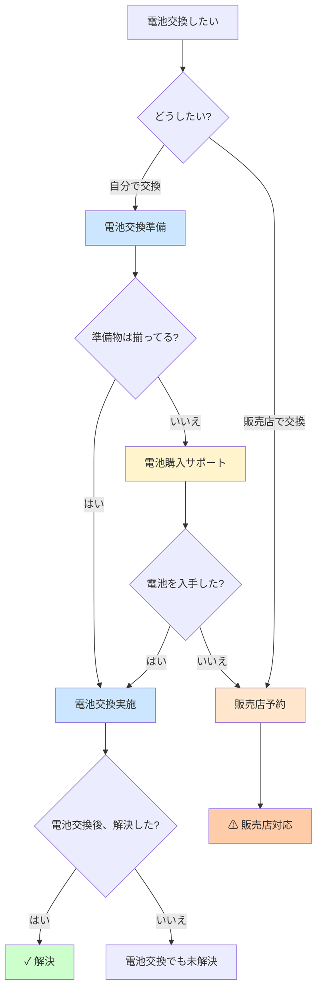

# THEME-001 実践版フロー定義

## テーマ情報

- **テーマID**: THEME-001
- **テーマ名**: スマートキーでドアが開かない（実践版）
- **緊急度**: high
- **主要インテント**: I1（今すぐ使いたい）, I3（自分で直したい）, I4（壊したくない）

---

## フロー概要

実際のトヨタ取扱説明書の内容に基づいた、実践的なユーザージャーニーフローです。

### 主な特徴

1. ✅ **機械キーの正確な理解**
   - スマートキーに内蔵されている前提
   - 「持ってる?」ではなく「ある?」

2. ✅ **電池交換の詳細サポート**
   - 自分で交換 vs 販売店で交換の選択
   - 事前準備物の確認（マイナスドライバー、CR2450電池）
   - 電池購入サポート（オンライン・店舗検索）
   - 販売店予約への誘導

3. ✅ **リスク管理**
   - 「部品破損のおそれ」を明示
   - 安全な方法（販売店対応）への誘導

---

## 統計情報

### 生成データ

- **ノード数**: 28個
- **判定条件数**: 15個
- **エッジ数**: 30個
- **ガイド数**: 13個
- **ノード-インテント紐付け**: 28個

### 主要ルート

1. **機械キールート**: 5ノード
2. **電池交換ルート**: 8ノード（準備・購入・実施）
3. **バッテリー上がりルート**: 2ノード
4. **電波干渉ルート**: 3ノード
5. **その他診断ルート**: 3ノード

---

## 新規追加ガイド

### 電池交換関連

| ガイドID | タイトル | 内容 |
|:---------|:---------|:-----|
| GUIDE-004 | 事前準備物 | マイナスドライバー（大・小）、CR2450電池 |
| GUIDE-005 | 電池購入方法 | オンライン購入リンク、近くの店舗検索 |
| GUIDE-006 | 電池交換手順 | 注意: 部品破損のおそれあり |
| GUIDE-007 | 販売店予約・連絡先 | 予約フォーム、電話番号 |

### その他

| ガイドID | タイトル | 内容 |
|:---------|:---------|:-----|
| GUIDE-001 | 機械キーの取り出し方 | スマートキーからの取り出し手順 |
| GUIDE-002 | 機械キーの場所・保管方法 | 保管推奨場所 |
| GUIDE-008 | 電波干渉時の対応 | キーを車体に近づける方法 |
| GUIDE-009 | キー修理・交換手続き | 修理依頼方法 |
| GUIDE-010 | ドアロック故障時の対応 | 故障時の対処法 |
| GUIDE-011 | ロードサービス連絡先・依頼方法 | 緊急連絡先 |
| GUIDE-012 | 販売店連絡先・営業時間 | 店舗情報 |
| GUIDE-013 | 予防策・定期点検の案内 | メンテナンス情報 |

---

## 詳細フロー図

### 電池交換ルート（拡張版）



---

## 取扱説明書からの引用

### 電池交換について

> 「電池が消耗しているときは、新しい電池に交換してください。電池はご自身で交換できますが、部品が破損するおそれがあるので、トヨタ販売店で交換することをおすすめします。」

### 事前準備物

> 「交換をするには、次のものを準備してください。
> - マイナスドライバー
> - 小さいマイナスドライバー
> - リチウム電池：CR2450」

### 電池の入手

> 「リチウム電池CR2450の入手
> 電池はトヨタ販売店・時計店およびカメラ店などで購入できます。」

---

## ユーザー体験の改善点

### Before（従来のフロー）

```
電池交換したい → [GUIDE] 電池交換手順 → 解決?
```

**問題点:**
- 準備物の確認なし
- 電池入手方法の案内なし
- 販売店対応の選択肢なし

### After（実践版フロー）

```
電池交換したい 
  → 自分で or 販売店?
    → 自分で → 準備物確認
      → 揃ってる → 交換実施
      → 揃ってない → 電池購入サポート
        → 入手した → 交換実施
        → 入手できない → 販売店予約
    → 販売店 → 販売店予約
```

**改善点:**
- ✅ ユーザーの選択肢を提供
- ✅ 事前準備を確認
- ✅ 電池入手をサポート
- ✅ リスク（部品破損）を明示
- ✅ 安全な方法（販売店）への誘導

---

## L2コンテキストデータとの連携

### 時刻による優先度調整

| 時刻 | 推奨ルート | 理由 |
|:-----|:-----------|:-----|
| 平日9-17時 | 販売店対応 | 営業時間内 |
| 夜間・休日 | 自分で交換 or 機械キー | 販売店が閉まっている |
| 深夜 | 機械キー使用 | 緊急対応 |

### ユーザー属性による優先度調整

| 属性 | 推奨ルート | 理由 |
|:-----|:-----------|:-----|
| DIY経験あり | 自分で交換 | 成功率が高い |
| 初心者 | 販売店対応 | 安全性優先 |
| 過去に電池交換経験 | 自分で交換 | 手順を知っている |

### 位置情報による優先度調整

| 位置 | 推奨ルート | 理由 |
|:-----|:-----------|:-----|
| 販売店近く | 販売店対応 | すぐに行ける |
| 遠隔地 | 自分で交換 or 機械キー | 移動が困難 |
| 店舗近く | 電池購入サポート | すぐに購入できる |

---

## 実装例

### 電池購入サポートガイド

```json
{
  "guide_id": "GUIDE-005",
  "title": "電池購入方法",
  "content": {
    "online": [
      {
        "name": "Amazon",
        "url": "https://amazon.co.jp/s?k=CR2450",
        "price_range": "¥200-500"
      },
      {
        "name": "楽天市場",
        "url": "https://search.rakuten.co.jp/search?k=CR2450",
        "price_range": "¥200-500"
      }
    ],
    "nearby_stores": {
      "use_location": true,
      "store_types": [
        "トヨタ販売店",
        "時計店",
        "カメラ店",
        "家電量販店",
        "コンビニエンスストア"
      ],
      "radius_km": 5
    }
  }
}
```

### 販売店予約ガイド

```json
{
  "guide_id": "GUIDE-007",
  "title": "販売店予約・連絡先",
  "content": {
    "phone": {
      "display": "お近くの販売店を検索",
      "action": "show_dealer_list",
      "use_location": true
    },
    "web_booking": {
      "url": "https://toyota.jp/service/reserve",
      "label": "オンライン予約"
    },
    "business_hours": {
      "weekday": "9:00-18:00",
      "saturday": "9:00-17:00",
      "sunday": "定休日"
    }
  }
}
```

---

## 次のステップ

### 1. ガイドコンテンツの作成
- 各ガイドIDに対応する詳細コンテンツを作成
- L1データ（取扱情報）から具体的な手順を抽出

### 2. L2コンテキストデータとの連携
- 時刻、位置、ユーザー属性に基づく優先度調整
- 動的なガイド選択

### 3. 電池購入サポートの実装
- オンラインショップAPIとの連携
- 位置情報サービスとの連携
- 店舗在庫確認機能

### 4. 販売店予約システムとの連携
- 予約フォームの組み込み
- 電話発信機能
- 営業時間の動的表示

---

## まとめ

実践版フローでは、実際の取扱説明書の内容を忠実に反映し、以下を実現しました:

1. ✅ **正確な情報**: 取扱説明書の記載に準拠
2. ✅ **ユーザー選択**: 自分で対応 vs 専門家依頼
3. ✅ **段階的サポート**: 準備→入手→実施
4. ✅ **リスク管理**: 注意事項の明示
5. ✅ **購入サポート**: オンライン・店舗の両方に対応
6. ✅ **予約支援**: 販売店への誘導

これにより、ユーザーは自分の状況に応じた最適な解決策を選択できるようになりました。
