# THEME-001「スマートキーでドアが開かない」視覚化フロー

## 全体フロー（水平レイアウト）

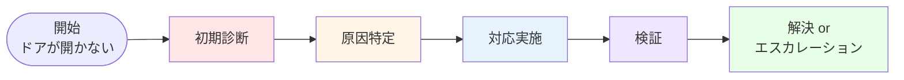

---

## 詳細フロー（Phase 1: 初期診断）

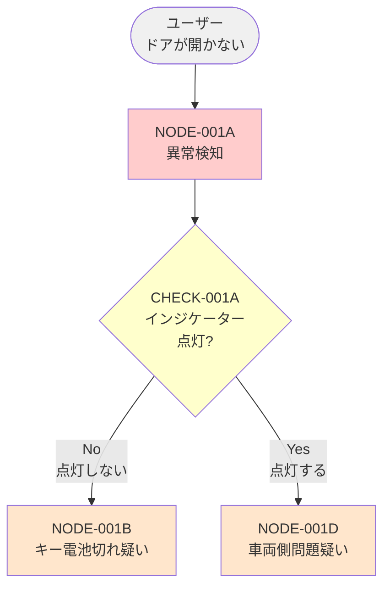

---

## 詳細フロー（Phase 2A: 電池切れルート）

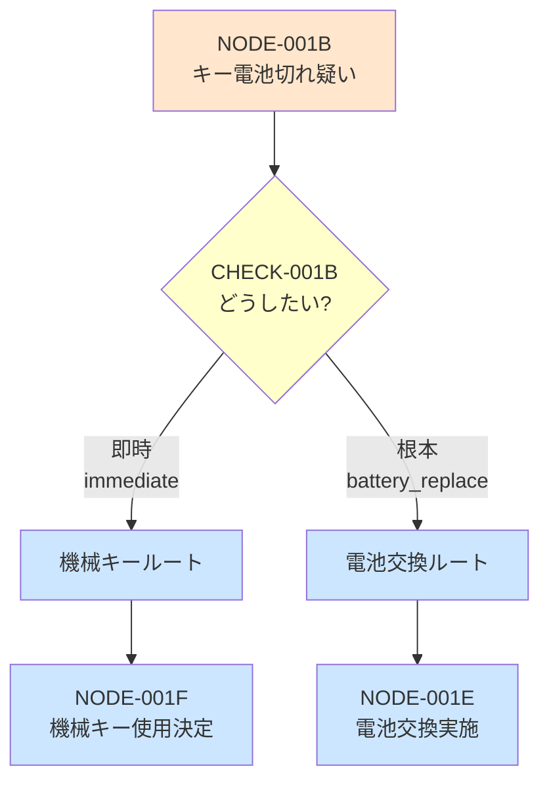

---

## 詳細フロー（Phase 2B: 機械キー対応）

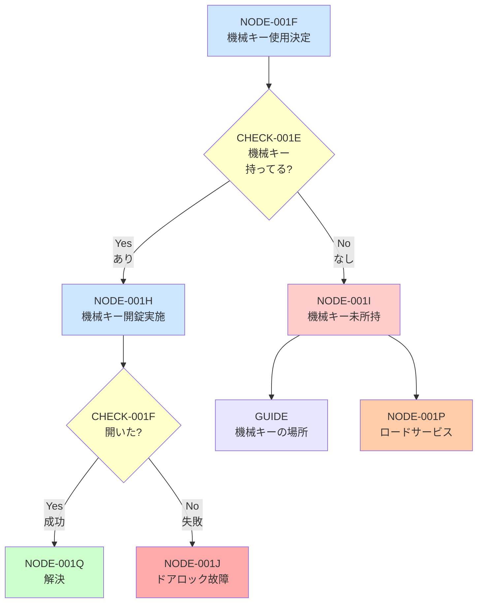

---

## 詳細フロー（Phase 2C: 電池交換対応）

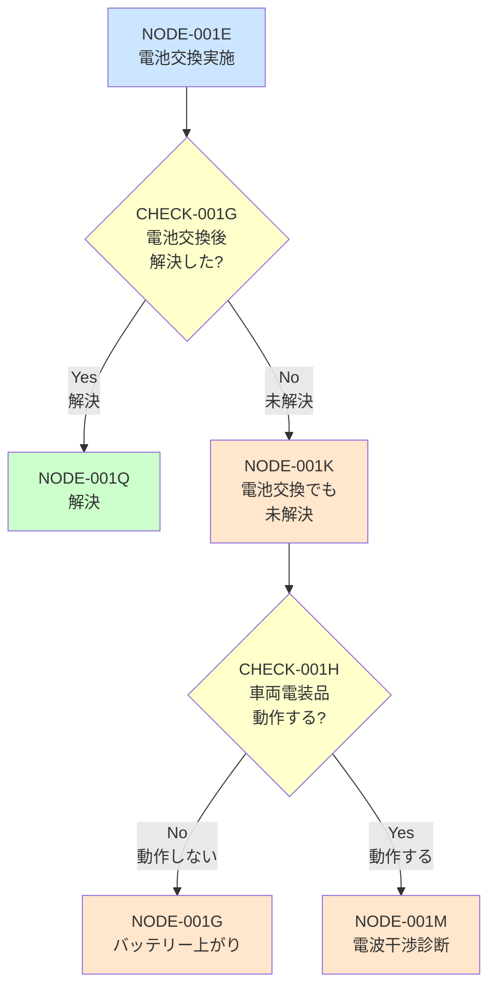

---

## 詳細フロー（Phase 3: 車両側問題ルート）

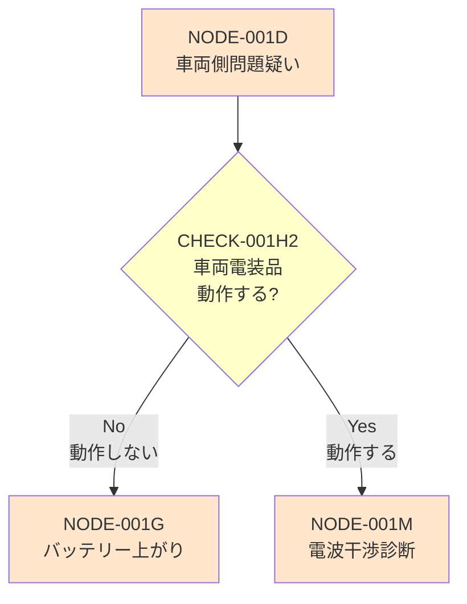

---

## 詳細フロー（Phase 4A: 電波干渉診断）

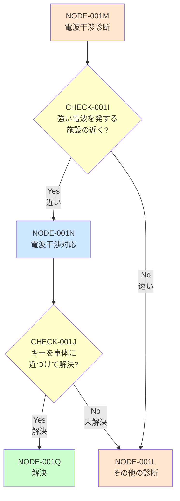

---

## 詳細フロー（Phase 4B: その他診断）

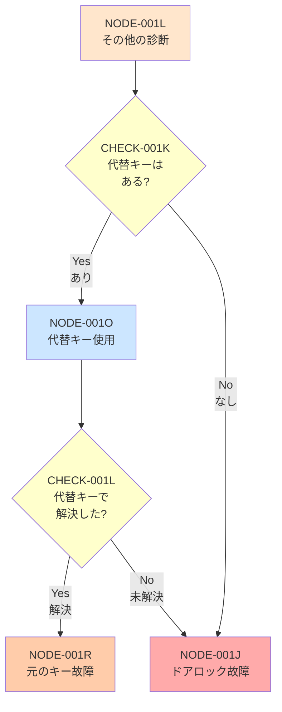

---

## 詳細フロー（Phase 5: バッテリー上がり対応）

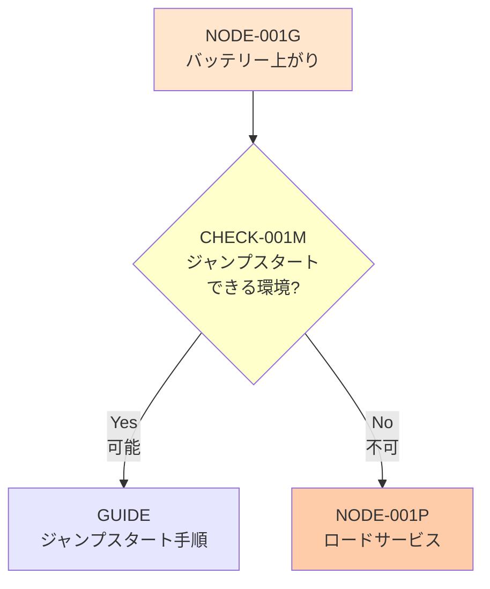

---

## 詳細フロー（Phase 6: 終端処理）

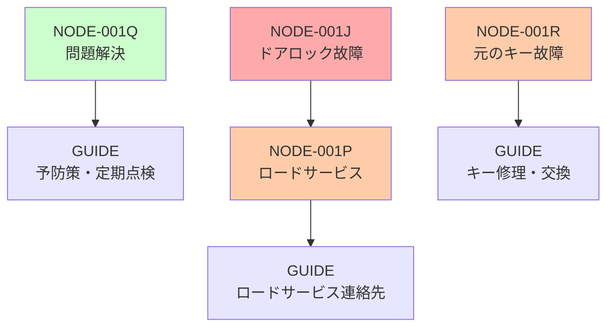

---

## 簡略版フロー（全体俯瞰）

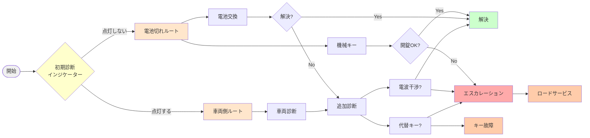

---

## 色の凡例

| 色 | 意味 |
|:---|:-----|
| 🔴 赤系 (#ffcccc, #ffaaaa) | 問題発生、診断、故障判定 |
| 🟠 オレンジ系 (#ffe6cc) | 原因仮説、診断中 |
| 🟡 黄色系 (#ffffcc) | 判定条件、ユーザー選択 |
| 🔵 青系 (#cce6ff) | 対応実施中 |
| 🟣 紫系 (#e6e6ff) | ガイドコンテンツ |
| 🟢 緑系 (#ccffcc) | 解決、成功 |
| 🟤 茶系 (#ffccaa) | エスカレーション、専門家対応 |

---

## ノード分類

### 📍 判定ノード（菱形）
- CHECK-001A〜M: ユーザーへの質問、状態確認

### 📦 処理ノード（四角）
- NODE-001A〜R: 状態、対応、判定

### 📘 ガイドノード（四角）
- GUIDE-*: 最終的な案内コンテンツ

### 🎯 終端ノード
- NODE-001Q: 解決
- NODE-001P: ロードサービス
- NODE-001J: ドアロック故障
- NODE-001R: キー故障

---

## 使い方

### 1. **全体俯瞰**: 簡略版フローで全体像を把握
### 2. **詳細確認**: Phase別フローで各ルートの詳細を確認
### 3. **実装**: CSVデータと照らし合わせて実装
