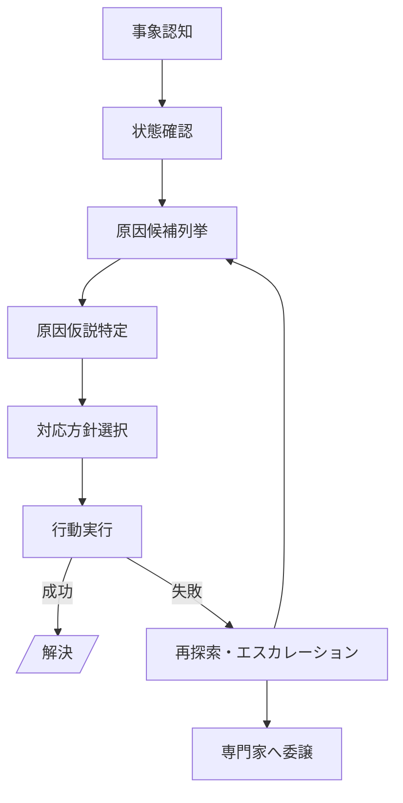

## フロー型化（THEME-001 を題材にした思考・行動パターン）

このドキュメントは、THEME-001「スマートキーでドアが開かない」のフローを題材として、  
人間の思考や行動がどのように遷移していくかを **汎用的な「型」** として整理したものです。

---

## 1. 思考・行動フェーズの定義

トラブル対応における人の思考・行動は、おおまかに次のフェーズに分解できます。

- **F0: 事象認知**
  - 何が起きたかを認識する段階。
  - 例: 「スマートキーでドアが開かない」「いつもと違う音がする」。

- **F1: 状態確認**
  - 現在の状態を観察・計測し、「今どうなっているか」を確かめる段階。
  - 例: 「スマートキーのボタンを押してインジケーターは点灯するか？」  
        「メーターにどんな警告灯が出ているか？」。

- **F2: 原因候補列挙**
  - 観察結果から、あり得る原因候補をいくつか列挙する段階。
  - 例: 「電池切れ」「車両側の故障」「電波干渉」「操作ミス」など。

- **F3: 原因仮説特定**
  - 今回のケースで、どの原因が最もありそうかを選ぶ段階。
  - 例: 「インジケーターが点灯しない → 電池切れ仮説が最有力」。

- **F4: 対応方針選択**
  - 仮説に対して、どのような方針で対応するかを選ぶ段階。
  - 例:  
    - 「すぐに開けたい → 機械キーで開ける」  
    - 「安全に直したい → 電池を購入してから交換する」  
    - 「自信がない → 販売店やロードサービスに任せる」。
  - 実務的には、次のような **サブフェーズ** を含んでいると考えると整理しやすい。
    - **F4-1: 方針候補の選択**  
      - 例: 「自分で電池交換する」か「販売店で電池交換する」かを選ぶ。
    - **F4-2: 方針実行のための前提条件確認**  
      - 例: ボタン電池・ドライバーなど、作業に必要なものが手元にあるかを確認する。  
      - 条件が満たされない場合は、方針の見直し（販売店に切り替える等）につながる。
    - **F4-3: 意思決定支援（購入案内・リスク通知）**  
      - 例1: 「電池が手元にない」場合に、購入先（近くの店舗やECサイト）を案内する。  
        - 購入先を案内する行為そのものは、ユーザーの方針選択を助ける情報提供であり **F4** に属する。  
        - 実際に店舗に行く／ECで注文する行動は **F5: 行動実行** に属する。
      - 例2: 「電池はご自身で交換できますが、部品が破損するおそれがあるので販売店での交換をおすすめします。」  
        - ユーザーにリスクを伝え、  
          「本当に自分で作業を続けるか／販売店に任せるか」の最終判断を促すステップであり、**F4 の中のリスク提示** として位置付けられる。

- **F5: 行動実行**
  - 選んだ方針に基づいて、具体的な行動を取る段階。
  - 例: 「機械キーを取り出す」「電池を購入し交換する」「販売店を予約する」など。

- **F6: 結果評価**
  - 行動の結果を確認し、問題が解消したかどうかを判断する段階。
  - 例: 「ドアは開いたか？」「エンジンはかかったか？」。

- **F7: 再探索／エスカレーション**
  - 結果が不十分な場合に、「別の仮説を検討する／専門家に任せる」など、次の一手を決める段階。
  - 例:  
    - 「電池を替えてもダメ → バッテリー上がりや電波干渉を疑う」  
    - 「自力対応は限界 → ロードサービスや販売店にエスカレーション」。

---

## 2. THEME-001 へのマッピング例

THEME-001 の具体的なノードを、上記フェーズに対応付けると以下のようなイメージになります。

- **F0: 事象認知**
  - `スマートキーでドアが開かない`（THEME_001_START）

- **F1: 状態確認**
  - 「スマートキーのボタンを押してランプが点灯するか？」  
    - 点灯しない → `キー電池切れ疑い`（THEME_001_N001）  
    - 点灯する → `車両側問題疑い`（THEME_001_N011） など

- **F2/F3: 原因候補列挙／原因仮説特定**
  - 電池切れ、バッテリー上がり、電波干渉、ドアロック故障などの各ノードが、  
    「原因候補」および「現在の仮説」として機能している。

- **F4: 対応方針選択**
  - 「すぐ開けたい → 機械キー使用」  
  - 「自分で電池交換する／販売店に任せる」  
  - 「ジャンプスタートを試す／ロードサービスを呼ぶ」 などの分岐。

- **F5: 行動実行**
  - 機械キー取り出し、電池交換実施、ジャンプスタート実施、販売店予約、ロードサービス要請など。

- **F6: 結果評価**
  - 各行動の後に「はい（解決）／いいえ（未解決）」の確認が入り、  
    解決ノード（`解決`）に到達するかどうかを判定。

- **F7: 再探索／エスカレーション**
  - 「電池交換でも未解決」から別の仮説（バッテリー上がり・電波干渉など）へ遷移。  
  - 最終的に「ドアロック故障」や「ロードサービス／販売店対応」といった、  
    専門家対応・修理フェーズへのエスカレーションに至る。

---

## 3. 汎用テンプレート（Mermaid サンプル）

他のテーマでも使えるように、上記フェーズを抽象化したフローテンプレートを示します。

---

## 4. データ構造（CSV など）に落とし込む際の観点

この「フロー型」をデータとして扱う場合、例えば次のような項目を持たせると、  
テーマをまたいで比較・検索しやすくなります。

- **phase**: F0〜F7 のフェーズID
- **label**: 画面表示用の日本語ラベル（例: 「キー電池切れ疑い」）
- **description**: そのノードでユーザーが考えていること・していることの説明
- **input_condition**: どのような観察結果・状況でこのノードに入るか
- **action_type**: 観察／判断／選択／実行／評価／エスカレーション などの区分
- **next_on_success**: うまくいった場合に遷移するノードID
- **next_on_failure**: うまくいかなかった場合に遷移するノードID

このように定義しておくと、THEME-001 以外のトラブル（例: エンジンがかからない、警告灯が点灯した等）も、  
同じ「思考・行動の型」にマッピングして分析・再利用することができます。

